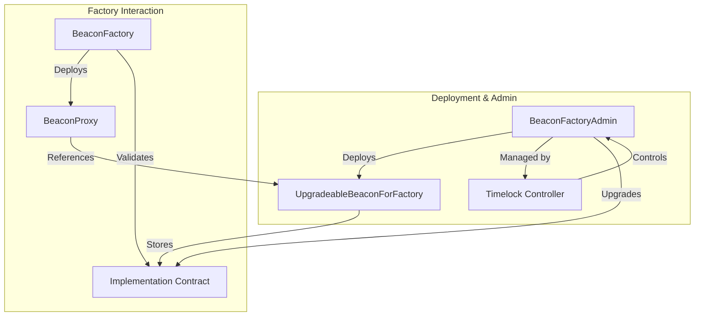

# Beacon Factory System Developer Guide

- [Beacon Factory System Developer Guide](#beacon-factory-system-developer-guide)
  - [**Architecture Diagram**](#architecture-diagram)
  - [Overview](#overview)
    - [Key Contracts](#key-contracts)
  - [Deployment Steps](#deployment-steps)
  - [Key Security Features](#key-security-features)
  - [Events to Monitor](#events-to-monitor)
  - [Key Considerations](#key-considerations)
  - [Example Workflow](#example-workflow)

## **Architecture Diagram**

Here’s a high-level architecture diagram using **Mermaid** to visualize how the contracts interact:



## Overview

The Beacon Factory System is designed to securely manage and upgrade implementations of contracts deployed using a beacon proxy pattern. The system ensures upgradeability, modularity, and security through the use of a `BeaconFactoryAdmin`, `UpgradeableBeaconForFactory`, and `BeaconFactory` contracts.

### Key Contracts

1. **BeaconFactoryAdmin**:
   - Manages and upgrades beacon implementations.
   - Protected by a timelock (`secureTimelockController`) to ensure secure upgrades.
   - Allows locking upgrades for a specified duration to prevent malicious changes.

2. **UpgradeableBeaconForFactory**:
   - Stores the implementation address for beacon proxies deployed by a factory.
   - Validates new implementations using the associated factory.
   - Immutable contract with an owner set to the `BeaconFactoryAdmin`.

3. **BeaconFactory**:
   - Deploys beacon proxies that reference the implementation stored in the `UpgradeableBeaconForFactory`.
   - Implements validation logic for new implementations.

---

## Deployment Steps

1. **Deploy BeaconFactoryAdmin**:
   - Deploy the `BeaconFactoryAdmin` contract with the owner's address and the initial timelock controller (`secureTimelockController`).
   - Example:

     ```solidity
     new BeaconFactoryAdmin(ownerAddress, timelockControllerAddress);
     ```

2. **Deploy UpgradeableBeaconForFactory**:
   - Use the `deployUpgradeableBeaconForFactory` function in `BeaconFactoryAdmin` to deploy a new beacon for a specific factory.
   - Example:

     ```solidity
     address upgradeableBeacon = beaconFactoryAdmin.deployUpgradeableBeaconForFactory(
         "MyBeaconFactory",
         beaconFactoryAddress,
         startingImplementation
     );
     ```

3. **Set Timelock Controller**:
   - Assign a secure timelock controller to the `BeaconFactoryAdmin` to manage upgrades.
   - Ensure the timelock duration is at least 72 hours for security.

4. **Deploy Contracts Using BeaconFactory**:
   - Use the `BeaconFactory` to deploy new contracts referencing the beacon implementation.
   - Example:

     ```solidity

    BeaconProxy beaconProxy = new BeaconProxy(
            address(upgradeableBeacon),
            abi.encodeWithSelector(IContract.initialize.selector, param0, param1, param2)
        );

     ```

5. **Upgrade Implementations**:
   - Use the `upgradeBeaconFactoryImplementation` function in `BeaconFactoryAdmin` to upgrade the beacon implementation.
   - Ensure upgrades are only performed after the timelock period has expired.

---

## Key Security Features

- **Timelock Protection**:
  - All upgrades are protected by a 72 hour timelock (`secureTimelockController`) to allow time for review and vetoing malicious upgrades.

- **Trusted Controllers**:
  - Only trusted addresses can take over the `secureTimelockController` role.

- **Validation**:
  - Factories validate new implementations before they are set in the beacon.

- **Upgradeable Locking**:
  - Upgrades can be locked for a specified duration to prevent malicious changes during emergencies.

---

## Events to Monitor

1. **`SetLockTimestamp(uint256 oldLockTimestamp, uint256 newLockTimestamp)`**:
   - Emitted when the lock timestamp is updated.

2. **`BeaconFactoryImplementationUpgraded(address indexed beaconFactory, address indexed newImplementation)`**:
   - Emitted when the beacon implementation is upgraded.

3. **`TransferSecureTimelockController(address oldController, address newController)`**:
   - Emitted when the secure timelock controller is transferred.

4. **`BeaconUpgraded(address indexed oldImplementation, address indexed newImplementation)`**:
   - Emitted when the beacon implementation is upgraded.

---

## Key Considerations

- Use a trusted timelock controller with a minimum delay of 72 hours.
- Always validate new implementations before upgrading beacons.
- Monitor events for transparency and security.
- Use the `lockBeaconUpgradesForDuration` function to lock upgrades during emergencies.

---

## Example Workflow

1. Deploy `BeaconFactoryAdmin`.
2. Deploy `UpgradeableBeaconForFactory` via the admin.
3. Deploy contracts using the `BeaconFactory`.
4. Upgrade the beacon implementation using the timelocked admin.
5. Lock upgrades if necessary for added security.
