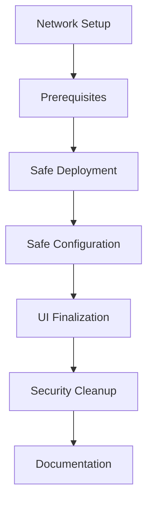

# Create2Safe Deployment Process

- [Create2Safe Deployment Process](#create2safe-deployment-process)
  - [Create2 Address Generation Rules](#create2-address-generation-rules)
  - [Factory Address Importance](#factory-address-importance)
  - [Deployer Key Considerations](#deployer-key-considerations)
  - [Salt Index System](#salt-index-system)
  - [Deployment Process](#deployment-process)
    - [1. Network Setup](#1-network-setup)
    - [2. Deployment Configuration](#2-deployment-configuration)
    - [3. Deployment Steps](#3-deployment-steps)
    - [4. Owner Configuration](#4-owner-configuration)
    - [5. Safe UI Configuration](#5-safe-ui-configuration)
  - [Security Cleanup](#security-cleanup)
  - [Documentation Updates](#documentation-updates)
  - [Directory Structure](#directory-structure)
  - [Version Considerations](#version-considerations)



## Create2 Address Generation Rules

- Reference available in [create2-rules](../../../images/CREATE2-rules.png)
- Address calculation formula: keccak256(sender address, salt, keccak256(init code))
- Owner address is part of init code, affecting final address

## Factory Address Importance

- Must verify proxy factory address (version 1.3.0) exists on target chain
- If factory not deployed, would need omnichain safe on version 1.4.1
- Different factory address means different safe addresses
- Note: Gnosis can deploy factory 1.3.0 later at same address

## Deployer Key Considerations

- Deployer address doesn't affect safe address, but the initialization params do
- Current schema sets deployer as initial owner
- Rationale: Owners change over time, but need deterministic address
- Deployer key needed for initial ownership transfer
- Risk: If leaked, malicious actors can front-run on new chains
  - Can't affect existing safes
  - Only impacts future chain deployments

## Salt Index System

In `scripts/deploy/deployCreate2Safe.ts`, salts are used to determine the final safe address starting at zero.

## Deployment Process

### 1. Network Setup

To configure the network in `hardhat.config.ts`:

1. Visit chainlist.org to get the official RPC URL for your target network
2. Add a new network entry in the networks section
3. Add `.env` variable to overwrite the default network rpc
4. Add blockexplorer URL for etherscan verification

### 2. Deployment Configuration

- Update `create2.config.ts` with the proper CREATE2 deployer
- Use `scripts/deploy/deployCreate2Safe.ts` (yarn deploy:safe --network <network>)

### 3. Deployment Steps

```bash
# Dry run first
yarn deploy:safe --network hardhat

# Deploy each safe individually
yarn deploy:safe --network mainnet
```

### 4. Owner Configuration

Validate the owners of Safes on other chains and use that as a reference for the new chain.

- Use `scripts/safe/setSafeOwners.ts`
- Configure:
  - Safe address
  - Owners to add
  - Threshold (recommend using 1 for now to swap out the CREATE2 deployer after)
- Script prompts for validation before each transaction

### 5. Safe UI Configuration

1. Import new address book
2. Connect deployer wallet
3. Settings → Remove signer (deployer)
4. Set final threshold
5. Verify configuration
6. Execute Tx

## Security Cleanup

1. Remove create2 deployer from injected wallet
2. Delete key from environment variables
3. Verify all configurations

## Documentation Updates

- Update smart contract directory
- Update address book
- Update knowledge base
  - Document chain-specific details

## Directory Structure

```
├── scripts/
│   ├── deploy/
│   │   ├── CREATE2/
│   │   │   └── create2.config.ts
│   │   └── deployCreate2Safe.ts
│   └── safe/
│       └── setSafeOwners.ts
└── hardhat.config.ts
```

## Version Considerations

- Currently using 1.3.0
- 1.4.1 benefits need investigation
- Version affects factory address
