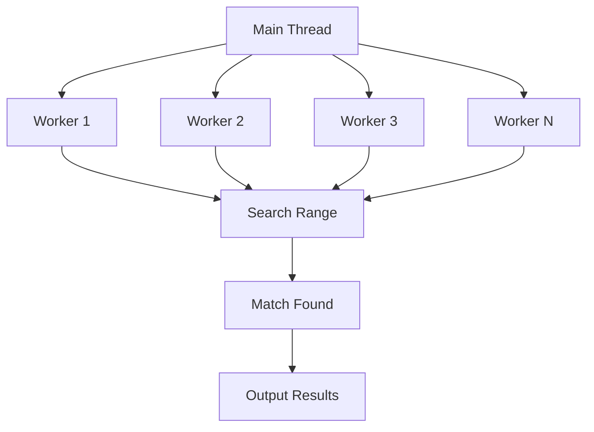

# 🔮 CREATE3 Vanity Address Generator

> [!IMPORTANT]
> This tool is designed to generate vanity addresses for contract deployments using the CREATE3 pattern. It supports running both as a Hardhat task and as a standalone script.

## 📑 Table of Contents

- [🔮 CREATE3 Vanity Address Generator](#-create3-vanity-address-generator)
  - [📑 Table of Contents](#-table-of-contents)
  - [🔍 Overview](#-overview)
  - [🧩 Vanity Pattern Types](#-vanity-pattern-types)
  - [🚀 Usage](#-usage)
    - [As a Hardhat Task](#as-a-hardhat-task)
      - [Options](#options)
      - [Example](#example)
    - [As a Standalone Script](#as-a-standalone-script)
      - [Options](#options-1)
      - [Example](#example-1)
  - [📋 Custom Pattern Examples](#-custom-pattern-examples)
    - [Pattern JSON File Format](#pattern-json-file-format)
    - [Common Vanity Patterns](#common-vanity-patterns)
  - [📊 Output Format](#-output-format)
  - [🔧 Architecture](#-architecture)
  - [🔒 Security Considerations](#-security-considerations)

[↑ Back to Top](#-create3-vanity-address-generator)

## 🔍 Overview

The CREATE3 Vanity Address Generator helps you find salts that will result in contract addresses with specific patterns when deployed using the CREATE3 pattern. This is particularly useful for cross-chain deployments where you want the same contract address on multiple chains.

> [!TIP]
> Using the same vanity address across multiple chains improves UX and makes your protocol more recognizable.

Key features:

- Multi-threaded processing to maximize search speed
- Support for multiple vanity pattern types
- Generates salts that include front-running protection
- Works across any EVM-compatible chain
- Same address can be achieved on multiple chains

[↑ Back to Top](#-create3-vanity-address-generator)

## 🧩 Vanity Pattern Types

The generator supports several pattern types:

1. **prefix** - Addresses that start with specific characters (e.g., `0xED6E...`)
2. **suffix** - Addresses that end with specific characters (e.g., `...ED6E`)
3. **both** - Addresses that start and end with the same pattern (e.g., `0xED6E...ED6E`)
4. **repeating-prefix** - Addresses that start with repeating characters (e.g., `0xAAAA...`)
5. **repeating-suffix** - Addresses that end with repeating characters (e.g., `...AAAA`)
6. **custom** - Addresses that match a custom regex pattern

Default patterns search for variations of `ED6E` (a reference to VaultEDGE).

```javascript
// Default patterns searched
[
  { type: 'prefix', value: 'ed6e' },        // 0xED6E...
  { type: 'suffix', value: 'ed6e' },        // ...ED6E
  { type: 'both', value: 'ed6e' },          // 0xED6E...ED6E
  { type: 'repeating-prefix', value: 'ed6e' }, // 0xAAAA...ED6E
  { type: 'repeating-suffix', value: 'ed6e' }  // 0xED6E...AAAA
]
```

[↑ Back to Top](#-create3-vanity-address-generator)

## 🚀 Usage

### As a Hardhat Task

The script registers a Hardhat task that can be run with:

```bash
npx hardhat generate-vanity-addresses --deployer 0xYOUR_ADDRESS [options]
```

#### Options

| Option | Description | Default |
|--------|-------------|---------|
| `--deployer` | The address that will deploy the contracts (required) | - |
| `--createx` | The address of the CreateX contract | From network or DEFAULT_X_DEPLOYER_ADDRESS |
| `--patterns` | JSON string of patterns to search for | Default patterns |
| `--attempts` | Maximum attempts per pattern | 1000000 |
| `--output` | Output file path to save results | ./vanity-addresses.json |

#### Example

```bash
npx hardhat generate-vanity-addresses \
  --deployer 0xf39Fd6e51aad88F6F4ce6aB8827279cffFb92266 \
  --patterns '[{"type":"prefix","value":"ed6e"},{"type":"suffix","value":"ed6e"}]' \
  --attempts 500000 \
  --output ./my-vanity-addresses.json
```

[↑ Back to Top](#-create3-vanity-address-generator)

### As a Standalone Script

The script can also be run directly using Node:

```bash
ts-node scripts/vanity/create3VanityGenerator.ts --deployer 0xYOUR_ADDRESS [options]
```

#### Options

| Option | Description | Default |
|--------|-------------|---------|
| `--deployer` | The address that will deploy the contracts (required) | - |
| `--createx` | The address of the CreateX contract | DEFAULT_X_DEPLOYER_ADDRESS |
| `--patterns-file` | JSON file containing patterns to search for | Default patterns |
| `--attempts` | Maximum attempts per pattern | 1000000 |
| `--output` | Output file path to save results | ./vanity-addresses.json |
| `--help` | Display help message | - |

#### Example

```bash
ts-node scripts/vanity/create3VanityGenerator.ts \
  --deployer 0xf39Fd6e51aad88F6F4ce6aB8827279cffFb92266 \
  --patterns-file ./my-patterns.json \
  --attempts 500000
```

Where `my-patterns.json` might contain:

```json
[
  { "type": "prefix", "value": "ed6e" },
  { "type": "suffix", "value": "ed6e" }
]
```

[↑ Back to Top](#-create3-vanity-address-generator)

## 📋 Custom Pattern Examples

### Pattern JSON File Format

```json
[
  { "type": "prefix", "value": "1234" },
  { "type": "suffix", "value": "abcd" },
  { "type": "both", "value": "5678" },
  { "type": "repeating-prefix", "value": "a1b2" },
  { "type": "repeating-suffix", "value": "c3d4" },
  { "type": "custom", "value": "^0x[a-f0-9]{3}0[a-f0-9]{36}$" }
]
```

> [!NOTE]
> Custom patterns can use any valid JavaScript RegExp pattern string.

### Common Vanity Patterns

| Description | Type | Value | Example Match |
|-------------|------|-------|--------------|
| Address starts with 1234 | prefix | 1234 | 0x1234567890... |
| Address ends with DEAD | suffix | dead | ...000000DEAD |
| Address starts and ends with CAFE | both | cafe | 0xCAFE...CAFE |
| Address starts with repeating A's | repeating-prefix | aaaa | 0xAAAAAAAA... |
| Address with specific format | custom | ^0x00[0-9a-f]{38}$ | 0x00123456... |

[↑ Back to Top](#-create3-vanity-address-generator)

## 📊 Output Format

The script outputs results as a JSON file with the following structure:

```json
{
  "timestamp": "2025-04-18T12:34:56.789Z",
  "deployer": "0xf39Fd6e51aad88F6F4ce6aB8827279cffFb92266",
  "createX": "0xba5Ed099633D3B313e4D5F7bdc1305d3c28ba5Ed",
  "results": [
    {
      "salt": "0xf39fd6e51aad88f6f4ce6ab8827279cfffb92266010000000000000000000001",
      "address": "0xED6E123456789abcdef0123456789abcdef0123",
      "pattern": {
        "type": "prefix",
        "value": "ed6e"
      }
    },
    {
      "salt": "0xf39fd6e51aad88f6f4ce6ab8827279cfffb92266010000000000000000000002",
      "address": "0x123456789abcdef0123456789abcdef0123ED6E",
      "pattern": {
        "type": "suffix",
        "value": "ed6e"
      }
    }
  ]
}
```

The console output also displays a summary table of the results.

[↑ Back to Top](#-create3-vanity-address-generator)

## 🔧 Architecture



The script uses Node.js worker threads to parallelize the search process:

1. The main thread divides the search space among workers
2. Each worker tries different salt values
3. When a match is found, the worker returns the result
4. The main thread collects and outputs all results

The salt format includes protections against front-running:
- First 20 bytes = deployer address (permissioned deploy protection)
- 21st byte = 0x01 (cross-chain redeploy protection)
- Last 11 bytes = random data for vanity search

[↑ Back to Top](#-create3-vanity-address-generator)

## 🔒 Security Considerations

> [!WARNING]
> It's critical to understand the security implications of CREATE3 vanity addresses.

1. **Deployer Binding**: Salts are bound to the deployer address to prevent front-running
2. **Cross-Chain Protection**: The salt includes a byte to prevent redeployment attacks across chains
3. **Proper Usage**: Always use the generated salt with the same deployer address and CreateX contract

When using for cross-chain deployment:
1. Ensure CreateX is at the same address on each chain
2. Use the exact same salt on each chain
3. The implementation bytecode can be different on each chain
4. The resulting contract address will be the same across chains

[↑ Back to Top](#-create3-vanity-address-generator) 