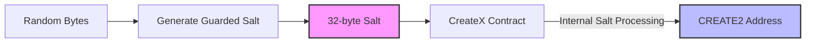
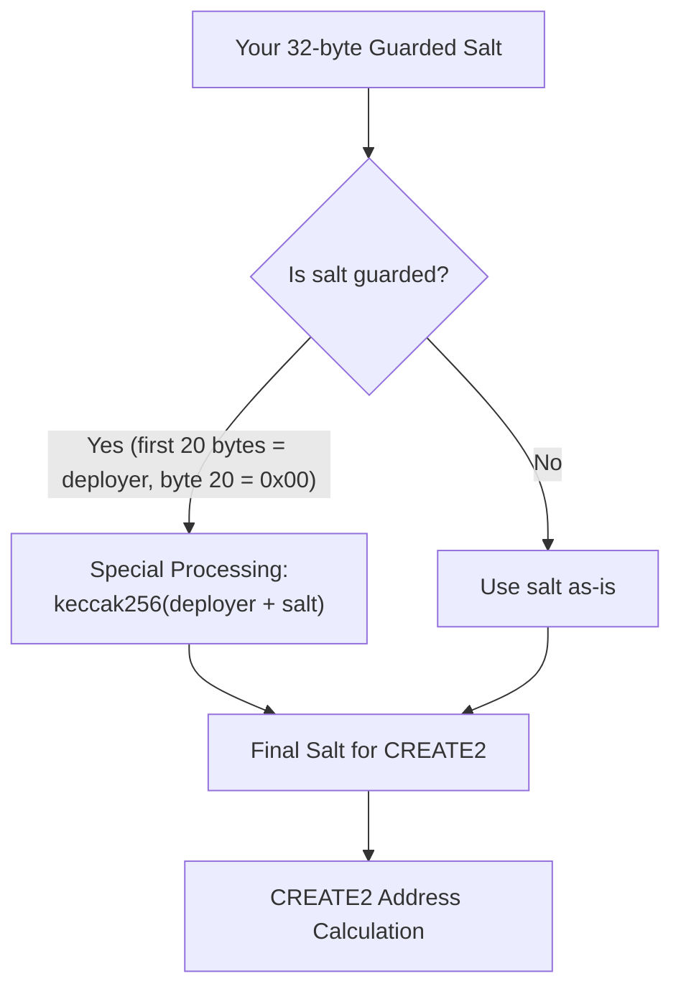
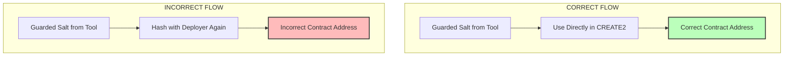
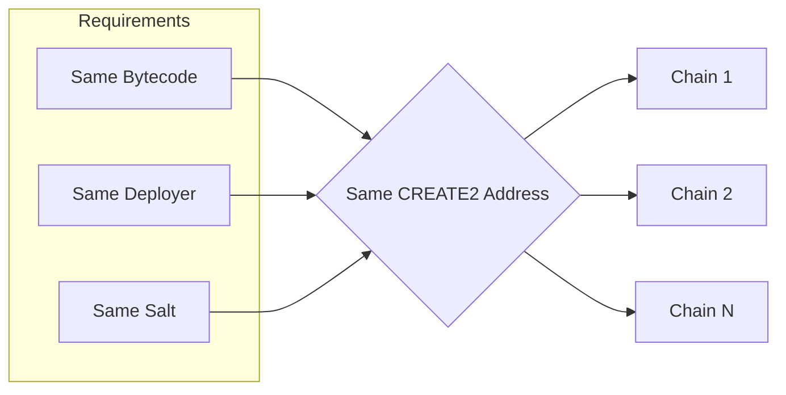
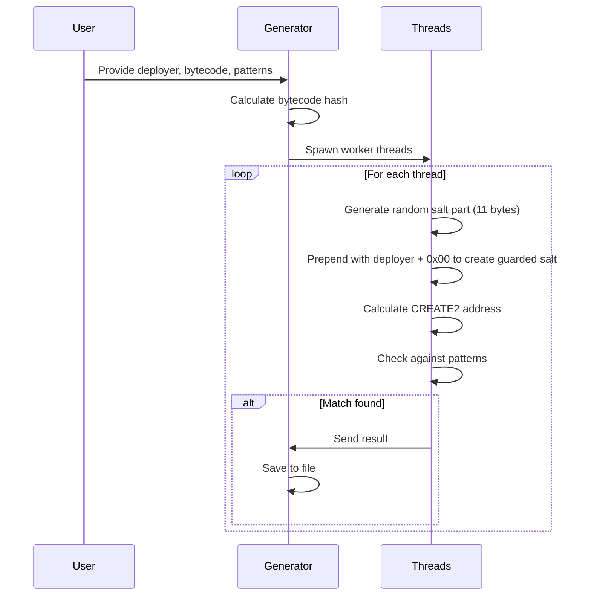

# 🔮 CREATE2 Vanity Address Generator

A high-performance Rust implementation for generating vanity addresses using CREATE2 deployment method, capable of processing billions of salt combinations per hour.

- [🔮 CREATE2 Vanity Address Generator](#-create2-vanity-address-generator)
  - [✨ Features](#-features)
  - [🛠️ Setup](#️-setup)
  - [📋 Usage](#-usage)
  - [🧂 Understanding CREATE2 Salts](#-understanding-create2-salts)
    - [🔑 Salt vs. Guarded Salt](#-salt-vs-guarded-salt)
    - [🧠 Understanding the CreateX Contract Salt Processing](#-understanding-the-createx-contract-salt-processing)
    - [⚠️ Common Pitfalls](#️-common-pitfalls)
  - [📝 Pattern Format](#-pattern-format)
  - [🚀 Example Run](#-example-run)
  - [🌉 Cross-Chain Deployment](#-cross-chain-deployment)
  - [⚙️ How It Works](#️-how-it-works)
  - [📊 Output Format](#-output-format)
  - [🐞 Troubleshooting](#-troubleshooting)

## ✨ Features

- **High Performance**: Process billions of salt combinations per hour
- **Multi-threading**: Utilizes both Tokio for task-level and Rayon for data-level parallelism
- **Pattern Support**: Search for multiple vanity patterns simultaneously
- **Real-time Match Display**: Shows matches as they're found
- **Automatic Saving**: Results saved to JSON file
- **Cross-chain Compatible**: Supports consistent cross-chain deployments

## 🛠️ Setup

1. Install Rust and Cargo:

   ```bash
   curl --proto '=https' --tlsv1.2 -sSf https://sh.rustup.rs | sh
   ```

2. Build the project:

   ```bash
   cd scripts/vanity/create2
   cargo build --release
   ```

3. Run the generator:

   ```bash
   ./target/release/create2-vanity-generator \
       --deployer 0xYourDeployerAddress \
       --bytecode-file path/to/bytecode.json \
       --patterns-file create2-patterns.json
   ```

## 📋 Usage

```bash
USAGE:
    create2-vanity-generator [OPTIONS] --deployer <ADDRESS> --bytecode-file <FILE>

OPTIONS:
    --deployer <ADDRESS>       The address that will deploy the contracts
    --bytecode-file <FILE>     Path to bytecode JSON file
    --patterns-file <FILE>     JSON file containing patterns to search for
    --attempts <NUMBER>        Maximum number of attempts [default: 1000000]
    --threads <NUMBER>         Number of worker threads to use [default: CPU count]
    --output <FILE>            Output file path to save results
```

## 🧂 Understanding CREATE2 Salts

> [!IMPORTANT]
> Understanding the difference between a **raw salt** and a **guarded salt** is critical for successfully using this tool and deploying contracts via CREATE2.

### 🔑 Salt vs. Guarded Salt

The salt mechanism in this tool works as follows:



**Guarded Salt Structure:**

```
┌─────────────────┬────┬─────────────┐
│  Deployer Addr  │ 00 │ Random Part │
│   (20 bytes)    │    │  (11 bytes) │
└─────────────────┴────┴─────────────┘
       Bytes 0-19    20    Bytes 21-31
```

1. **Raw Salt**: The random value (11 bytes) you generate
2. **Guarded Salt**: A 32-byte value where:
   - First 20 bytes = Deployer address
   - Byte 20 = 0x00 (disables cross-chain protection)
   - Last 11 bytes = Random part generated by this tool

> [!WARNING]
> The salt returned by this tool is the **complete 32-byte guarded salt**. DO NOT hash this with the deployer address again in your deployment script as the salt already contains the deployer address.

### 🧠 Understanding the CreateX Contract Salt Processing

**The Core Confusion Point**: The CreateX contract itself processes the salt you provide in a special way before using it for the CREATE2 address calculation.

Here's what happens inside the CreateX contract:



**From the CreateX Contract Code:**

```solidity
function _guard(bytes32 salt) internal view returns (bytes32 guardedSalt) {
    // ...
    if (senderBytes == SenderBytes.MsgSender && redeployProtectionFlag == RedeployProtectionFlag.False) {
        // Configures solely a permissioned deploy protection.
        guardedSalt = _efficientHash({a: bytes32(uint256(uint160(msg.sender))), b: salt});
    }
    // ...
}
```

**What This Means:**

1. When you create a salt with the deployer address in the first 20 bytes and 0x00 in byte 20, the CreateX contract will:
   - Detect this pattern
   - Hash your salt with the deployer address
   - Use this hash as the actual salt for CREATE2

2. This is why when you take a salt from our vanity generator and try to hash it again with the deployer in your deployment script, you get a different address - **the salt is being double-processed**.

> [!IMPORTANT]
> This "special salt processing" in CreateX is a security feature designed to prevent unauthorized deployments, but it's also what causes confusion if you're not aware of how it works.

### ⚠️ Common Pitfalls

1. **Double-Hashing**: Many deployment scripts will hash the salt with the deployer again, resulting in different addresses:



2. **Bypassing Guarded Salt**: Attempting to use your own raw salt directly can lead to inconsistent addresses.

> [!TIP]
> Always use the exact 32-byte salt produced by this tool in your deployment script, without any additional transformation.

## 📝 Pattern Format

The patterns file should be a JSON array of pattern objects:

```json
[
  {
    "type": "prefix",
    "value": "ed6e"
  },
  {
    "type": "suffix",
    "value": "ed6e"
  },
  {
    "type": "regex",
    "value": "^0xed6e[0-9a-f]{4}"
  }
]
```

## 🚀 Example Run

1. First, get your contract's bytecode. You can do this using Hardhat:

   ```typescript
   const factory = await ethers.getContractFactory("YourContract");
   const initCode = factory.getDeployTransaction(...constructorArgs).data;
   console.log(initCode);
   ```

2. Save the bytecode to a JSON file (bytecode.json):

   ```json
   {
     "contractName": "YourContract",
     "bytecode": "0x...",
     "bytecodeHash": "",
     "artifactPath": ""
   }
   ```

3. Run the generator:

   ```bash
   ./target/release/create2-vanity-generator --deployer 0x4d3eFF0c6432B2E31861732aCc3483008c050A61 --bytecode-file bytecode.json --patterns-file create2-patterns.json --attempts 1000000000 --threads 10
   ./target/release/create2-vanity-generator --deployer 0x4d3eFF0c6432B2E31861732aCc3483008c050A61 --bytecode-file veUSDTokenProxy-bytecode.json --patterns-file create2-patterns.json --attempts 10000000 --threads 10
   ```

## 🌉 Cross-Chain Deployment

For consistent cross-chain deployments:



To achieve this:

1. Use the exact same initialization code on all chains
2. Ensure byte 20 of the salt is set to 0x00 (disables chain-specific salt transformation)
3. Use the same deployer address on all chains

## ⚙️ How It Works

The generator process:



The CREATE2 address calculation:

```
keccak256(0xff ++ factory_address ++ salt ++ keccak256(init_code))[12:]
```

Where:

- `factory_address` is the address of the CreateX factory contract
- `salt` is the full 32-byte guarded salt
- `init_code` is the contract bytecode + constructor arguments

## 📊 Output Format

Results are saved in JSON format:

```json
{
  "timestamp": "2024-04-22T10:00:00Z",
  "deployer": "0x4d3eFF0c6432B2E31861732aCc3483008c050A61",
  "codeHash": "0x...",
  "results": [
    {
      "salt": "0x...",
      "address": "0x...",
      "pattern": "starts with ed6e",
      "attempt": 123456
    }
  ]
}
```

> [!IMPORTANT]
> The `salt` field in the output is the full 32-byte guarded salt that should be used directly in your deployment scripts.

## 🐞 Troubleshooting

> [!NOTE]
> If your deployed address doesn't match the expected address:

1. **Salt Double-Processing**: The most common issue is that the salt is being processed twice:
   - Once in your deployment script (incorrectly)
   - Once in the CreateX contract (correctly)

2. **Factory Address**: Verify you're using the correct CreateX factory address in your deployment script (0xba5Ed099633D3B313e4D5F7bdc1305d3c28ba5Ed)

3. **Bytecode**: Confirm the bytecode used during deployment exactly matches what was used in the generator

4. **Deployer**: The deployer address must match what was used in the generator

> [!TIP]
> For TypeScript/JavaScript deployments, modify your code to use the salt directly:
>
> ```typescript
> // INCORRECT - CAUSES DOUBLE HASHING:
> // const calculatedSalt = ethers.utils.solidityKeccak256(
> //   ['address', 'bytes32'],
> //   [deployerAddress, salt]
> // );
> 
> // CORRECT - LET CREATEX HANDLE THE SALT PROCESSING:
> const calculatedSalt = salt; // Use the salt directly from the vanity generator
> ```
